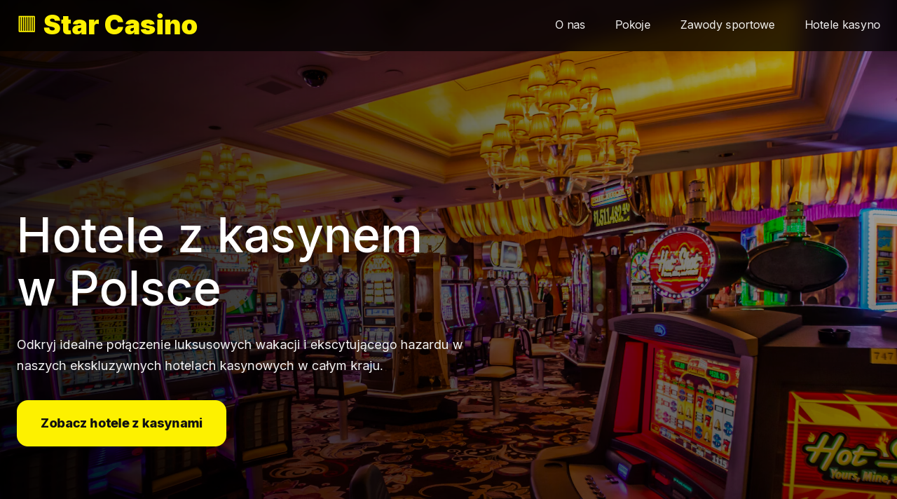

# 🎰 Star Casino — Interactive Gambling Hub

Интерактивный промо-лендинг под гемблинг-тематику (Gambling вертикаль в CPA/Affiliate маркетинге). Проект демонстрирует работу с динамическим интерфейсом и интерактивными пользовательскими сценариями.

## 🔗 Живое демо
Посмотреть проект в браузере: **[vladimir1212.github.io/star-casino](https://vladimir1212.github.io/star-casino/)**

---

## 📸 Превью интерфейса


---

## 🛠️ Технологический стек и особенности

* **Фронтенд:** HTML5, CSS3 (Адаптивная верстка, кастомные сетки для сложных игровых интерфейсов).
* **Интерактив:** Чистый JavaScript (ES6+) для реализации динамических элементов, анимаций и отклика интерфейса на действия пользователя.
* **CPA-ready:** Структура и логика страницы полностью оптимизированы под требования арбитражного трафика — быстрый отклик, фокус на целевом действии (CTA) и легкий код.
* **Кроссбраузерность:** Отличная и стабильная работа как на десктопных браузерах, так и на мобильных устройствах.

---

## ⚙️ Как запустить локально

1. Склонируйте репозиторий:
   ```bash
   git clone [https://github.com/Vladimir1212/star-casino.git](https://github.com/Vladimir1212/star-casino.git)
